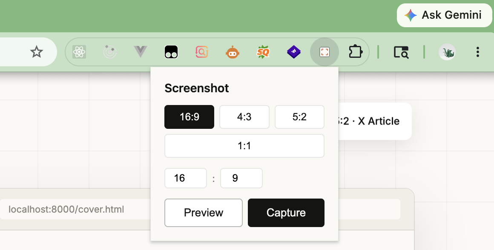
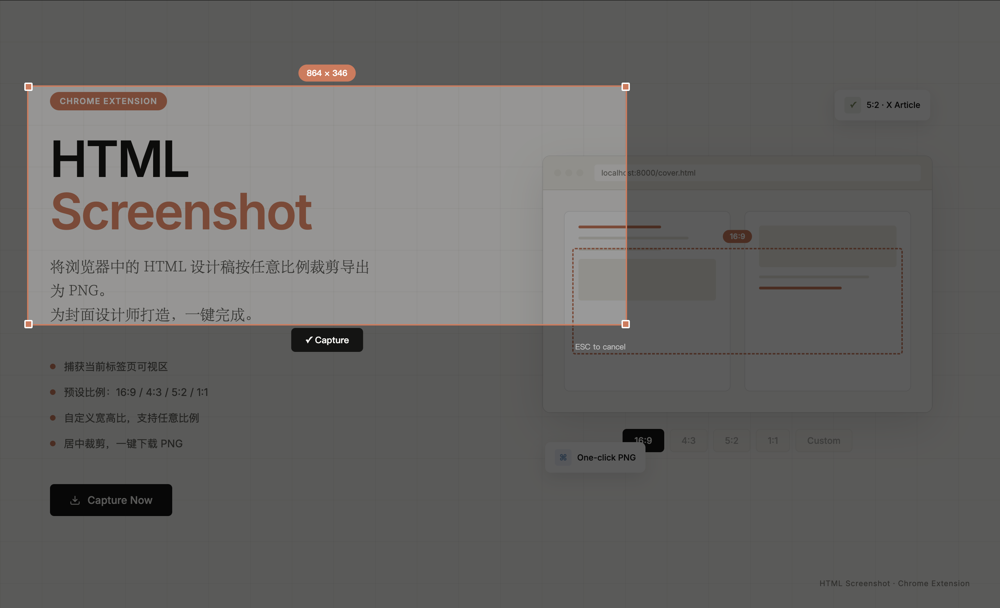

# HTML Screenshot

一款极简的 Chrome 浏览器扩展，专为 HTML 设计师打造——将浏览器中的设计稿按任意比例裁剪导出为 PNG。

<!-- 插件图标占位 -->
<p align="center">
  
</p>

## 为什么做这个

日常用 AI 生成 HTML 封面/海报/设计稿后，需要在浏览器中打开并截图保存。现有截图工具要么功能臃肿，要么没有精确的比例裁剪功能。这个扩展只做一件事：**按比例裁剪可视区，一键下载 PNG**。

### 已有 Snipaste，为什么不用？

Snipaste 是优秀的通用截图工具，但在「HTML 设计稿 → 指定比例 PNG」这个场景下不够顺手：

| | Snipaste | HTML Screenshot |
|---|---|---|
| **比例裁剪** | 手动拖拽选区，无法精确锁定比例 | 预设 16:9 / 4:3 / 5:2 / 1:1，自动锁定 |
| **操作步骤** | 截图 → 手动裁剪 → 调整比例 → 保存 | 选比例 → 一键下载，2 步完成 |
| **场景适配** | 通用截图，不区分浏览器/桌面 | 专为浏览器中的 HTML 设计稿优化 |
| **X 文章封面** | 需要手动对齐 5:2 比例 | 5:2 一键搞定 |

简单说：Snipaste 是瑞士军刀，这个扩展是手术刀。高频做同一个动作时，专用工具赢。

## 功能

- **一键截图**：选择比例，点击 Capture，立即下载居中裁剪后的 PNG
- **实时预览**：点击 Preview，页面上出现可拖拽的裁剪框，调整位置后确认下载
- **预设比例**：16:9 · 4:3 · 5:2 · 1:1
- **自定义比例**：支持输入任意宽高比
- **Retina 适配**：自动处理高 DPI 屏幕

## 功能演示

<!-- 演示截图占位：展示 popup 界面 -->
<p align="center">
  
</p>

<!-- 演示截图占位：展示 preview 模式的裁剪框 -->
<p align="center">
  
</p>

<!-- 演示 GIF 占位：完整操作流程 -->
<p align="center">
  
</p>

## 安装

1. 下载或 clone 本仓库
2. 打开 Chrome，访问 `chrome://extensions/`
3. 开启右上角「开发者模式」
4. 点击「加载已解压的扩展程序」
5. 选择本项目的文件夹

## 使用

### 快速截图（Capture）

1. 打开任意 HTML 页面
2. 点击工具栏上的 **HTML Screenshot** 图标
3. 选择比例（默认 16:9）
4. 点击 **Capture**
5. PNG 自动下载到默认下载目录

### 预览截图（Preview）

1. 点击工具栏图标
2. 选择比例
3. 点击 **Preview**
4. 页面上出现裁剪框——拖拽移动，四角可缩放
5. 调整到位后点击 **✓ Capture**
6. 按 `ESC` 取消

## 文件结构

```
html-screenshot-extension/
├── manifest.json       # Chrome 扩展配置
├── popup.html          # 弹窗 UI
├── popup.js            # 弹窗逻辑
├── content.js          # 页面注入脚本（预览/裁剪/下载）
├── background.js       # 后台截图服务
├── icons/              # 扩展图标
└── promo.html          # 宣传海报
```

## 技术

- Chrome Extension Manifest V3
- `chrome.tabs.captureVisibleTab` 捕获可视区
- Canvas API 裁剪
- Content Script 注入预览 overlay
- 无任何外部依赖

## License

MIT
